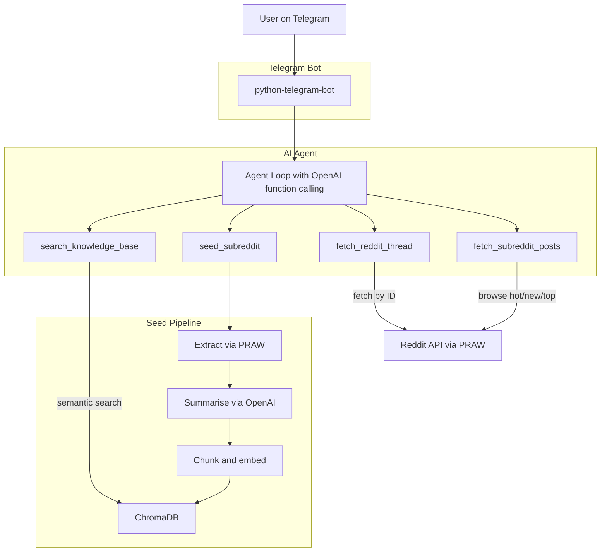

# Forager

An AI agent that collects and chats with news and discussions from across the web.

Forager can extract threads from Reddit, summarise them using an LLM, store the content in a vector database, and let you chat with it all via a Telegram bot.

## Architecture



## Features

- **Seed**: Extract threads from any subreddit, summarise them, and store in a vector database
- **Chat**: Conversational AI agent that searches stored content and fetches live Reddit data as needed
- **Telegram bot**: Chat with the agent from your phone

## Setup

### Prerequisites

- Python 3.10+
- [Poetry](https://python-poetry.org/docs/) for dependency management

### Installation

```bash
git clone https://github.com/oliverbatey/forager.git
cd forager
poetry install
```

### Environment Variables

Copy the example environment file and fill in your credentials:

```bash
cp .env.example .env
```

| Variable | Description |
|----------|-------------|
| `OPENAI_API_KEY` | OpenAI API key |
| `REDDIT_CLIENT_ID` | Reddit API client ID ([docs](https://www.reddit.com/wiki/api/)) |
| `REDDIT_CLIENT_SECRET` | Reddit API client secret |
| `TELEGRAM_BOT_TOKEN` | Telegram bot token (create via [@BotFather](https://t.me/BotFather)) |

## Usage

### Telegram Bot

```bash
python forager/runner.py bot
```

Then open your bot in Telegram and use:
- `/start` - Introduction and help
- `/seed python 5` - Ingest 5 threads from r/python
- `/status` - Check the knowledge base size
- `/clear` - Reset conversation history
- Send any message to chat with the agent

### CLI

```bash
# Seed the vector database directly
python forager/runner.py seed -s python --limit 5
```

## Agent Evaluations

See [docs/evals.md](docs/evals.md) for how the agent's tool-selection behaviour is tested using real LLM calls.

## Deployment (Fly.io)

```bash
# Install the Fly CLI: https://fly.io/docs/flyctl/install/
fly launch

# Create a persistent volume for ChromaDB data
fly volumes create forager_data --region lhr --size 1

# Set your secrets
fly secrets set \
  OPENAI_API_KEY=... \
  REDDIT_CLIENT_ID=... \
  REDDIT_CLIENT_SECRET=... \
  TELEGRAM_BOT_TOKEN=...

# Deploy
fly deploy
```
